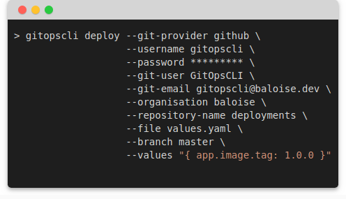

[](https://travis-ci.org/baloise/gitopscli) 
[](https://github.com/baloise/gitopscli/releases)
[](https://hub.docker.com/r/baloise/gitopscli/tags)
[](https://www.python.org/downloads/release/python-370/)
[](https://github.com/semantic-release/semantic-release)
[](https://gitpod.io/#https://github.com/baloise/gitopscli) 
[](https://github.com/baloise/gitopscli/blob/master/LICENSE)

# GitOps CLI

GitOps CLI is a command line interface (CLI) to perform operations on GitOps managed infrastructure repositories, including updates in YAML files.



## Quick Start
The official GitOps CLI Docker image comes with all dependencies pre-installed and ready-to-use. Pull it with:
```bash
docker pull baloise/gitopscli
```
Start the CLI and the print the help page with:
```bash
docker run --rm -it baloise/gitopscli --help
```

## Features
- Update YAML values in config repository to e.g. deploy an application.
- Add pull request comments.
- Create and delete preview environments in the config repository for a pull request in an app repository.
- Update root config repository with all apps from child config repositories.

For detailed installation and usage instructions, visit [https://baloise.github.io/gitopscli/](https://baloise.github.io/gitopscli/).

## Git Provider Support
Currently, we support both BitBucket Server and GitHub.

## License
[Apache-2.0](https://choosealicense.com/licenses/apache-2.0/)
